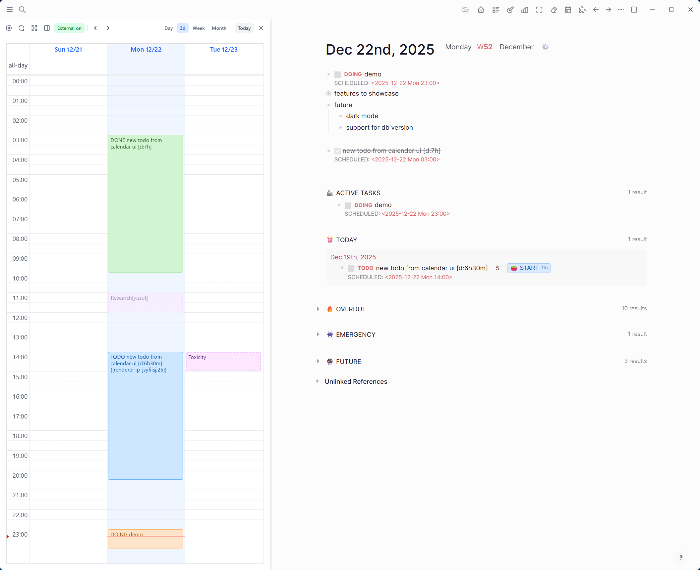
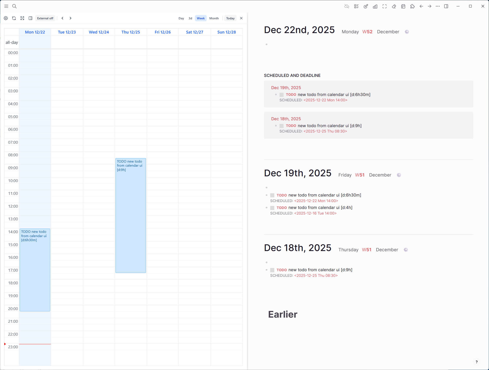
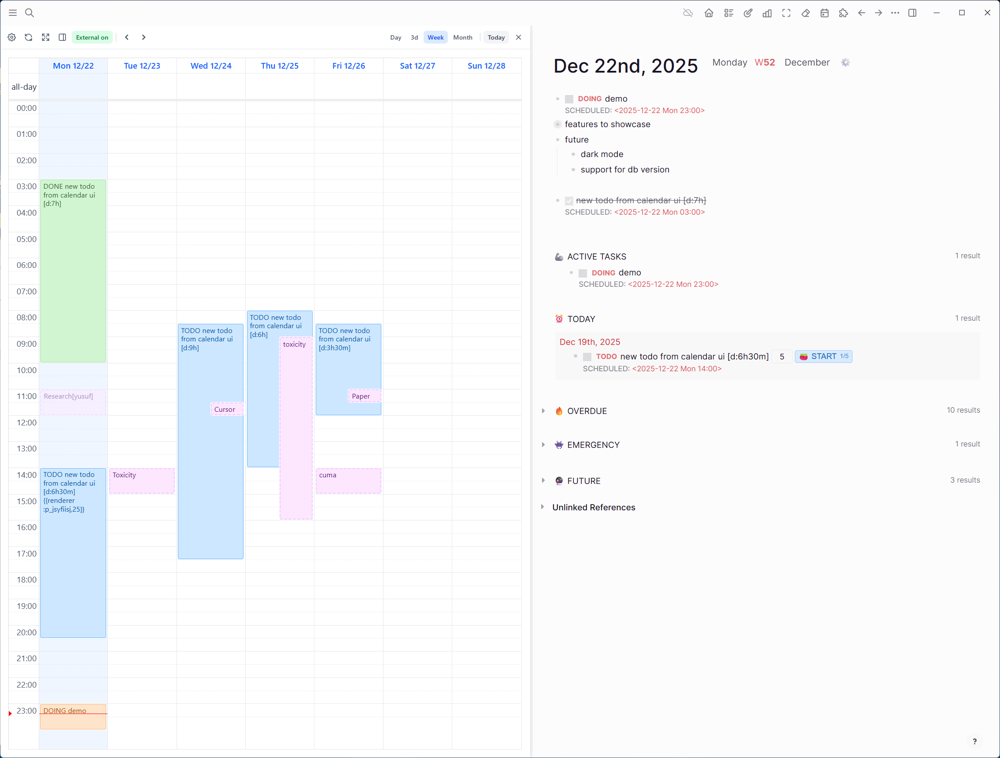

# Logseq Timebox

A calendar sidebar plugin for Logseq that lets you visualize and manage your scheduled tasks in a timebox-style calendar view.


> Important Reminders:
>
> This plugin is only tested on MD version. DB version is planned to be supported in the future.

## Features

- **Day/Week/Month/Multi-day Views** - Switch between different calendar views to plan your time (multi-day span is configurable)
- **Drag & Drop** - Move tasks by dragging them to a new time slot
- **Resize Events** - Adjust task duration by dragging the edges
- **Recurring Tasks** - Full support for Logseq's repeater patterns (`++1w`, `.+1d`, etc.)
- **Quick Create** - Click or drag on the calendar to create new scheduled tasks
- **Inline Edit** - Edit task titles directly from the calendar
- **Clear Schedule** - Remove scheduling from tasks with one click
- **External Calendars (ICS)** - Overlay read-only events from external feeds (requires manual installation)
- **Refresh** - Manually refresh events
- **Resizable Sidebar** - Drag to adjust the sidebar width
- **Left/Right Position** - Toggle sidebar position

## Later

- **Theme integration** - Seamless alignment with Logseq themes
- **DB Version Support** - Compatibility with Logseq database versions

## Screenshots

### General


### Demo


### More






## Installation

### From Logseq Marketplace (Recommended)
1. Open Logseq
2. Go to `...` → `Plugins` → `Marketplace`
3. Search for "Timebox"
4. Click `Install`

### Manual Installation
1. Download the latest release from [Releases](https://github.com/yusuf8834/logseq-timebox/releases)
2. Unzip the file
3. In Logseq, go to `...` → `Plugins` → `Load unpacked plugin`
4. Select the unzipped folder

## Usage

1. Click the calendar icon in the toolbar to open the sidebar
2. Use the settings (gear) button to configure view and behavior preferences
3. **Switch views**: Use Day / Multi-day / Week / Month buttons (multi-day shows as `3d`, `4d`, etc.)
4. **Create tasks**: Click on a time slot or drag to select a time range
5. **Move tasks**: Drag and drop events to reschedule
6. **Resize tasks**: Drag the bottom edge of an event to change duration
7. **Edit tasks**: Click the pencil icon on an event (or use configured click actions)
8. **Clear schedule**: Hover over an event and click the X button
9. **External calendars**: Toggle "External on/off" and use Refresh when needed
10. **Navigate**: Use the arrow buttons or "Today" to navigate dates

## Settings

Open settings via the gear icon in the toolbar or `...` → `Plugins` → `Settings`.

- **Start of day hour (0-23)**: Earliest hour shown in day/week/multi-day views
- **First day of week (0-6)**: 0 = Sunday, 1 = Monday, ... 6 = Saturday
- **Multi-day view length (days)**: Number of days shown in the multi-day view (min 2, max 14)
- **Single click action**: `none`, `edit`, or `goto`
- **Double click action**: `none`, `edit`, or `goto`
- **External calendar ICS URLs**: One URL per line (read-only overlays)
- **Show external calendars by default**: Initial visibility for ICS events

## Task Format

The plugin works with Logseq's native scheduling format:

```
TODO My task [d:1h30m]
SCHEDULED: <2025-12-04 Thu 09:00>
```

- `[d:1h30m]` - Duration token (optional, auto-generated when you resize)
- Supports all task markers: `TODO`, `DOING`, `NOW`, `LATER`, `WAITING`, `DONE`, `CANCELED`
- Preserves repeater patterns: `++1w`, `.+1d`, `+1m`, etc.

## Development

```bash
# Install dependencies
npm install

# Development mode
npm run dev

# Build for production
npm run build
```

## License

MIT

## Contributing

Contributions are welcome! Please feel free to submit a Pull Request.
